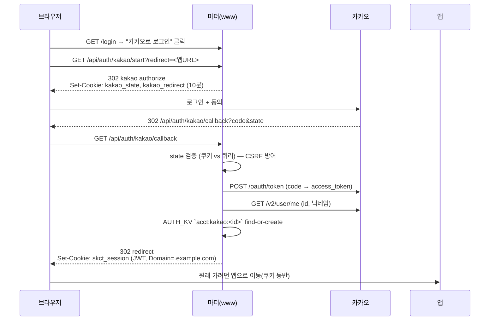
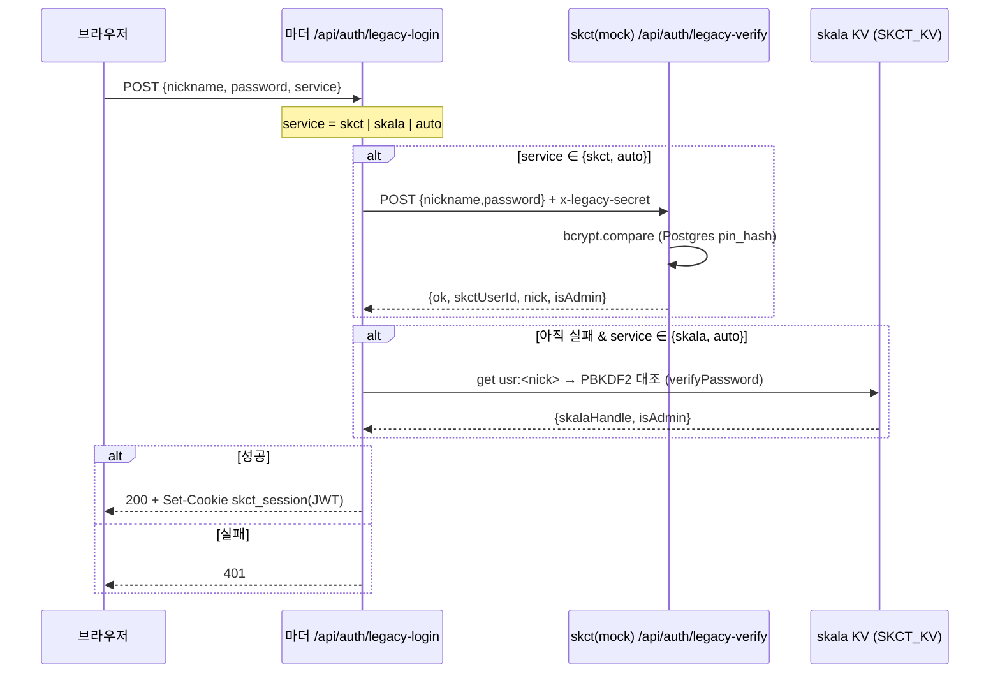
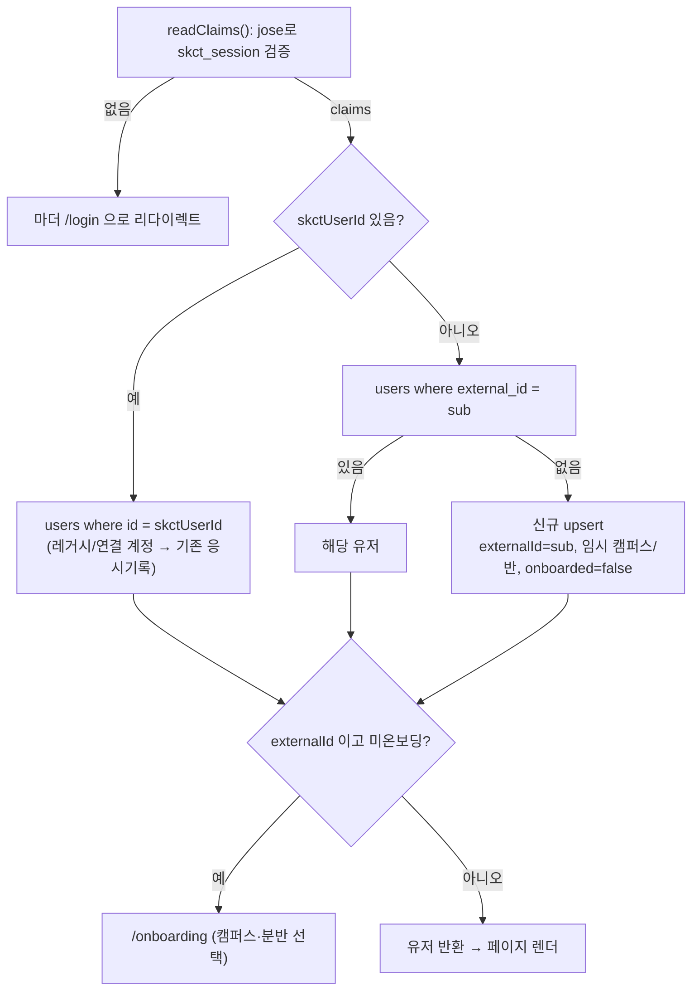
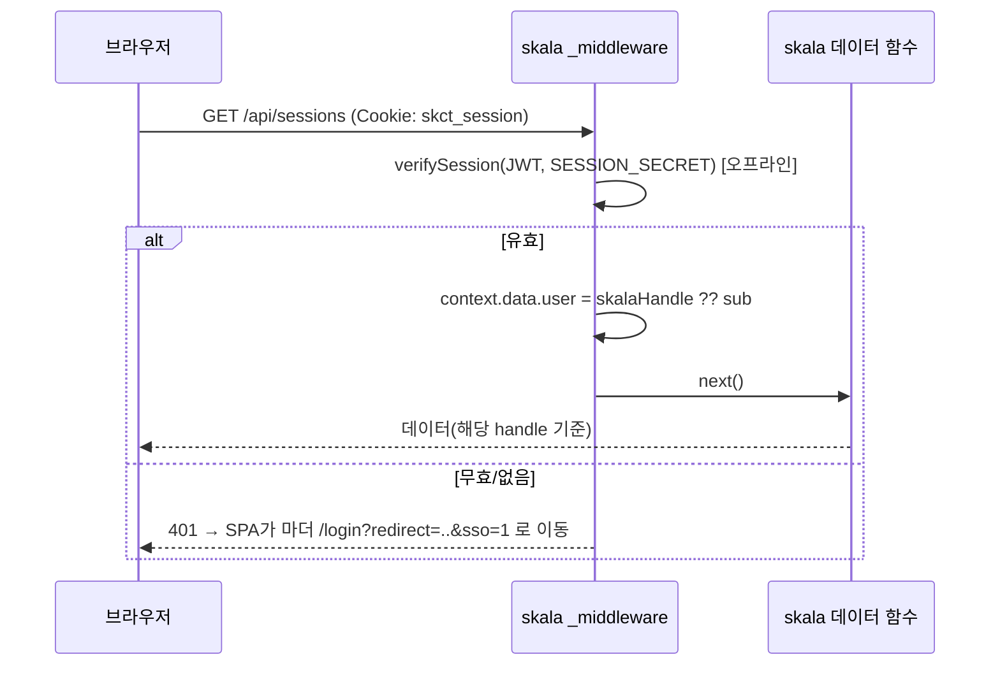
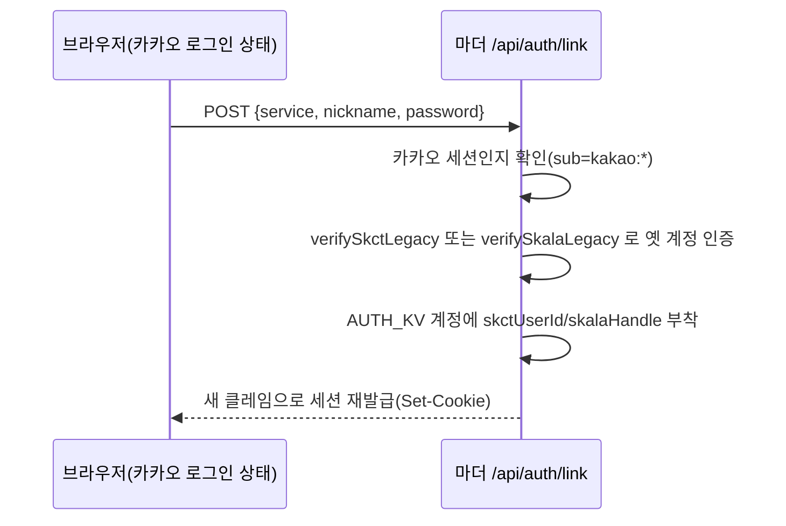

# SKCT 통합 로그인 시스템 (skct-mother)

세 개의 앱을 **하나의 상위 도메인 + 서브도메인**으로 묶어 **로그인 1회로 모두** 쓰게 만든 시스템의 관문(마더)입니다.
이 문서는 **아키텍처와 인증 로직**을 중심으로 정리합니다. 실제 셋업/배포 단계는 [`INTEGRATION.md`](./INTEGRATION.md) 참고.

## 목차
- [구성](#구성)
- [인증 로직 (핵심)](#인증-로직-핵심)
  - [1. 공유 세션 = 서명된 JWT](#1-공유-세션--서명된-jwt)
  - [2. 왜 서브도메인이면 로그인이 공유되나](#2-왜-서브도메인이면-로그인이-공유되나)
  - [3. 신규 로그인 — 카카오 OAuth](#3-신규-로그인--카카오-oauth)
  - [4. 기존 로그인 — 레거시 아이디/비번](#4-기존-로그인--레거시-아이디비번)
  - [5. 자식 앱이 세션을 소비하는 법](#5-자식-앱이-세션을-소비하는-법)
  - [6. 계정 연결 & 데이터 보존](#6-계정-연결--데이터-보존)
  - [7. 로그아웃](#7-로그아웃)
  - [8. 보안 설계 노트](#8-보안-설계-노트)
- [파일 지도](#파일-지도)
- [각 저장소에서 바뀐 것](#각-저장소에서-바뀐-것)
- [검증 상태](#검증-상태)

---

## 구성

```
example.com
├── www.example.com       → 마더(이 앱) · Vite SPA + Cloudflare Pages Functions
│                            로그인 관문: 랜딩 + 카카오/레거시 로그인 + 계정연결
├── mock.example.com      → skct · Next.js(Vercel) · Postgres  · 모의고사
└── practice.example.com  → skala-skct · Vite SPA(Cloudflare) · KV · 연습앱
```

| | 마더(www) | skct(mock) | skala(practice) |
|---|---|---|---|
| 역할 | **로그인/신원 발급** | 모의고사(자식) | 연습앱(자식) |
| 스택 | Vite + CF Pages Functions | Next.js / Vercel | Vite / CF Pages |
| 저장소 | KV `AUTH_KV` | Postgres(drizzle) | KV `SKCT_KV` |
| 인증 역할 | JWT **서명** | JWT **검증**(jose) | JWT **검증**(Web Crypto) |

> 원칙: **로그인·회원가입·OAuth·레거시 검증·계정연결은 오직 마더**에서 일어난다. 자식 앱에는 로그인 UI가 없고, 미인증이면 마더 `/login`으로 보낸다.

---

## 인증 로직 (핵심)

### 1. 공유 세션 = 서명된 JWT

로그인 성공 시 마더가 **하나의 쿠키**를 발급한다. 이 쿠키가 세 서브도메인에 모두 전송되어 SSO가 성립한다.

- **쿠키 이름**: `skct_session`
- **값**: HS256 **JWT** (`헤더.페이로드.서명`)
- **속성**: `Domain=.example.com`, `HttpOnly`, `SameSite=Lax`, `Secure`(배포), `Max-Age=30d`
- **서명**: 마더가 `SESSION_SECRET`(세 앱 공통)으로 HMAC-SHA256 서명

**페이로드(클레임)** — `shared/auth.ts`의 `SessionClaims`:

```jsonc
{
  "sub": "kakao:1234567",   // 통합 식별자: kakao:<id> | skct:<userId> | skala:<nick>
  "nick": "홍길동",          // 표시 닉네임
  "skctUserId": 7,           // (선택) 연결된 skct Postgres users.id
  "skalaHandle": "gildong",  // (선택) 연결된 skala 닉네임(핸들)
  "admin": true,             // (선택)
  "iat": 1750000000,
  "exp": 1752592000          // 30일
}
```

**왜 KV 토큰이 아니라 JWT인가?** skct는 Vercel, skala/마더는 Cloudflare로 **호스팅이 다르다**. 불투명 KV 토큰이면 검증 때마다 KV(=Cloudflare)를 봐야 해서 skct가 매번 원격 호출을 해야 한다. JWT는 **서명 검증만으로 오프라인 확인**이 가능해 세 앱이 서로를 호출하지 않아도 된다.

**크로스-런타임 상호운용**: 마더는 표준 HS256 JWT를 발급하므로,
- skct(Node) → `jose`의 `jwtVerify`로 검증
- skala(엣지) → Web Crypto HMAC로 검증 (`shared/auth.ts verifySession`)
- 마더 자신도 Web Crypto로 서명/검증

이 3자 상호운용은 런타임 테스트로 검증됨(아래 [검증 상태](#검증-상태)).

### 2. 왜 서브도메인이면 로그인이 공유되나

쿠키는 **도메인 이름**으로만 스코프된다(누가 호스팅하는지는 무관). 마더가 `Domain=.example.com`으로 쿠키를 발급하면 브라우저는 `www`·`mock`·`practice.example.com` **모두**에 그 쿠키를 보낸다 — Vercel이든 Cloudflare든 상관없다. `SameSite=Lax`도 셋이 **같은 사이트(등록가능 도메인 동일)**라 서브도메인 간 이동에서 정상 전송된다.

> 그래서 `*.vercel.app` / `*.pages.dev`(Public Suffix List 등재) 같은 기본 호스트로는 공유가 **불가능**하고, 반드시 공용 상위 도메인 1개가 필요하다.

### 3. 신규 로그인 — 카카오 OAuth

신규 가입/로그인은 카카오 전용이다. 표준 Authorization Code 플로우.



핵심 포인트
- **CSRF**: `start`에서 랜덤 `state`를 쿠키로 심고, `callback`에서 쿼리 `state`와 대조.
- **신원 키 = 카카오 user id** (이메일 아님). 카카오 email은 동의항목이라 항상 주어지지 않음. `AUTH_KV`의 `acct:kakao:<id>`가 통합 계정 레코드.
- **오픈 리다이렉트 방지**: 로그인 후 돌아갈 `redirect`는 `safeRedirect()`가 상대경로거나 `SESSION_COOKIE_DOMAIN` 하위 호스트일 때만 허용.
- 관련 파일: `functions/api/auth/kakao/start.ts`, `functions/api/auth/kakao/callback.ts`, `shared/edge.ts(safeRedirect)`.

### 4. 기존 로그인 — 레거시 아이디/비번

기존 유저는 **별도 UI**(`/login/legacy`)에서 기존 자격증명으로 로그인한다. 마더는 비번 해시를 옮기지 않고 **각 앱에 검증을 위임**한다.



핵심 포인트
- **비번 해시 두 종류가 그대로 유지**된다: skct=**bcrypt**(Node에서만 검증 → CF에서 bcrypt CPU 부담 회피), skala=**PBKDF2-SHA256**(Web Crypto, 마더가 KV를 직접 읽어 대조).
- **skct 위임 엔드포인트**(`skct/src/app/api/auth/legacy-verify/route.ts`)는 `x-legacy-secret` 헤더(마더·skct 공유 시크릿)로 보호. `pin_hash`가 있는 계정만 매칭 → 카카오로 만들어진 유저(pin_hash NULL)는 자연히 제외.
- **닉네임 충돌**: skct·skala에 같은 닉네임(다른 사람)이 있을 수 있어, `auto`는 skct→skala 순으로 시도하고 **비번이 맞는 쪽만** 인증된다. UI에서 서비스를 직접 고르면 확실히 구분된다. **자동 병합은 하지 않는다.**
- 발급되는 JWT: skct 계정 → `sub:"skct:<id>"`, `skctUserId`. skala 계정 → `sub:"skala:<nick>"`, `skalaHandle`.
- 관련 파일: `functions/api/auth/legacy-login.ts`, `shared/edge.ts(verifySkctLegacy/verifySkalaLegacy)`.

### 5. 자식 앱이 세션을 소비하는 법

#### skct (Next.js) — 클레임을 로컬 유저로 매핑

`src/lib/session.ts`가 쿠키의 JWT를 `jose`로 검증하고, 클레임을 skct의 Postgres `users` 행으로 해석한다. exam 테이블이 `users.id` FK를 요구하므로 **없으면 upsert**한다.



- 레거시 skct 유저: `skctUserId`가 기존 행을 가리켜 **응시기록 그대로**.
- 신규 카카오 유저: `external_id`로 새 행을 만들고 `/onboarding`에서 캠퍼스·분반을 받는다(모의고사의 평균 비교 기능이 이 값을 씀). 온보딩 완료 전까지 `requireUser()`가 게이트.
- 관련: `requireUser`/`requireAdmin`/`getCurrentUser`/`getSessionUserId`(`src/lib/session.ts`), `src/app/onboarding/*`.

#### skala (Vite/CF) — 미들웨어에서 검증 후 handle 전달

`functions/_middleware.ts`가 `/api/*` 요청마다 JWT를 Web Crypto로 검증하고, 사용자 핸들을 `context.data.user`에 넣는다. 연습앱의 문제셋·응시결과·코호트는 이 handle 기준으로 조회되므로 downstream 함수는 그대로 동작한다.



- 연결된 skala 유저 → `skalaHandle`(기존 닉네임) → **기존 연습기록 그대로**.
- 아직 연결 안 된 카카오 유저 → `sub`가 handle → 새 데이터를 그 아래 쌓는다.
- 무한 리다이렉트 방지: 관문을 다녀왔는데도(`?sso=1`) 미인증이면 자동 이동을 멈추고 수동 링크를 보여준다(`src/pages/AuthScreen.tsx`).

### 6. 계정 연결 & 데이터 보존

**데이터는 옮기지 않는다.** skct 응시기록은 Postgres(userId 기준), skala 연습기록은 KV(handle 기준)에 그대로 있고, **JWT의 `skctUserId`/`skalaHandle`이 각 앱을 자기 데이터로 연결**한다.

카카오로 로그인한 유저가 마더 `/settings`에서 옛 계정을 연결하면:



이후 그 유저의 JWT에는 `skctUserId`·`skalaHandle`이 실려, `mock`·`practice` 양쪽에서 **한 계정으로** 각자의 과거 데이터를 본다. **닉네임 기반 자동 병합은 하지 않으며**(서로 다른 사람일 수 있음), 연결은 항상 본인이 옛 비번으로 증명한다. 관련: `functions/api/auth/link.ts`.

### 7. 로그아웃

어느 앱에서 로그아웃하든 **`Domain=.example.com` 스코프로 `skct_session`을 삭제**하므로 세 앱이 동시에 로그아웃된다.
- 마더: `functions/api/auth/logout.ts`
- skct: `destroySession()`(`src/lib/session.ts`)
- skala: `functions/api/auth/logout.ts`(`clearSharedCookie`)

### 8. 보안 설계 노트

- **HttpOnly + SameSite=Lax + Secure(배포)** 쿠키. JS에서 토큰 접근 불가.
- **alg 고정 검증**: `verifySession`이 헤더 `alg==="HS256"`을 확인해 alg-confusion 방지.
- **상수시간 비교**: PBKDF2 검증은 상수시간 비교(`verifyPassword`).
- **CSRF(OAuth)**: `state` 쿠키↔쿼리 대조.
- **오픈 리다이렉트 차단**: `safeRedirect`가 도메인 화이트리스트(공유 쿠키 도메인) 밖 URL을 막음.
- **레거시 위임 보호**: skct `legacy-verify`는 공유 시크릿 헤더 필수.
- **MVP는 HS256(대칭키)**: 세 앱이 같은 `SESSION_SECRET`을 가진다(따라서 어느 앱이든 토큰 발급 가능). 신뢰 경계를 더 좁히려면 **ES256(비대칭)**으로 업그레이드 — 마더만 개인키로 서명, 자식은 공개키로 검증(향후 과제, `INTEGRATION.md` 참고).
- **이메일 없음**: 계정 복구 수단이 없으므로, 기존 유저는 설정에서 카카오를 연결해 두면 이후 카카오로 복구 가능.

---

## 파일 지도

**마더(`skct-mother`)**
```
shared/
  auth.ts     JWT 서명/검증(HS256, Web Crypto), 쿠키 헬퍼, PBKDF2 verifyPassword, base64url
  edge.ts     json, cookieOptsFrom, safeRedirect, verifySkctLegacy(위임), verifySkalaLegacy(KV)
functions/
  _middleware.ts               /api/* 게이트 + context.data.claims
  api/auth/kakao/start.ts       카카오 authorize 리다이렉트(state)
  api/auth/kakao/callback.ts    토큰교환→프로필→AUTH_KV→JWT 발급
  api/auth/legacy-login.ts      레거시 로그인(skct 위임 / skala KV)
  api/auth/link.ts              카카오 계정에 옛 계정 연결
  api/auth/me.ts                현재 신원(클레임)
  api/auth/logout.ts            공유 쿠키 제거
src/
  auth.tsx                     useAuth: me/legacyLogin/logout
  pages/Landing.tsx            랜딩(자식 앱 링크)
  pages/Login.tsx              카카오 버튼 + 레거시 링크
  pages/LegacyLogin.tsx        아이디/비번 + 서비스 선택(별도 UI)
  pages/Settings.tsx           카카오 연결/기존계정 가져오기/로그아웃
```

**skct(모의고사)** — 인증 관련
```
src/lib/session.ts                    JWT 검증 + 클레임→users 매핑/upsert + 온보딩 게이트 + destroySession
src/lib/actions/auth.ts               logout/logoutOnly/saveOnboarding/updateMyProfile/deleteAccount (이메일 로직 제거)
src/app/api/auth/legacy-verify/route.ts  마더의 bcrypt 검증 위임 대상
src/app/onboarding/page.tsx + components/OnboardingForm.tsx  캠퍼스/분반 온보딩
src/app/login/page.tsx                마더로 리다이렉트
src/db/schema.ts                      users: +external_id +onboarded, pin_hash nullable, auth_tokens 제거
```

**skala(연습앱)** — 인증 관련
```
shared/auth.ts                 +verifySession/readSharedSessionToken/clearSharedCookie (JWT 검증)
functions/_middleware.ts       KV토큰 → 공유 JWT 검증, handle 전달
functions/api/auth/me.ts       handle 기반 신원
functions/api/auth/logout.ts   공유 쿠키 제거
src/auth.tsx / pages/AuthScreen.tsx  자체 로그인 제거 → 마더로 리다이렉트(sso=1 루프가드)
```

---

## 각 저장소에서 바뀐 것

**마더(신규 저장소)**: 위 전체를 새로 작성.

**skct**
- 제거: `register`/`verify-email`/`find-id`/`forgot-password`/`reset-password` 페이지, `AuthForm`/`SimpleActionForm`, `lib/mail.ts`, `nodemailer`, `AccountMenu`의 이메일 비번변경 모달, `auth_tokens` 테이블.
- 변경: `session.ts`(자체 세션 발급 → 마더 JWT 검증/유저 매핑), `actions/auth.ts`(슬림화), `schema.ts`, `login` 페이지(마더 리다이렉트).
- 추가: `legacy-verify` 라우트, `/onboarding`.
- DB: `npm run db:push` 필요(기존 데이터 보존).

**skala**
- 제거: `functions/api/auth/login.ts`·`signup.ts`, 자체 로그인 UI, 초대코드(`SITE_PASSWORD`) 흐름.
- 변경: `_middleware`(JWT 검증), `me`/`logout`, `auth.tsx`/`AuthScreen`(마더 리다이렉트), `shared/auth.ts`(+JWT 검증).

---

## 검증 상태

**오프라인 검증 완료**
- 세 앱 타입체크/빌드 통과: 마더 `vite build`, skct `next build`, skala `tsc -b`+`vite build`, 모든 Functions 타입체크.
- **크로스-앱 암호 계약 런타임 테스트(5/5 통과)**: 마더 서명 JWT를 skct(`jose`)·skala(Web Crypto)가 검증 / 위조 secret·변조 토큰 거부 / skala PBKDF2 해시를 마더가 검증(레거시 skala 로그인).
- CF Pages SPA 딥링크용 `_redirects` 빌드 산출 확인.

**실환경 검증 필요(도메인·카카오·KV 준비 후)**: 실제 서브도메인 쿠키 공유, 카카오 OAuth 왕복, `db:push` 후 데이터 보존 — [`INTEGRATION.md`](./INTEGRATION.md)의 페르소나 5종 체크리스트로 확인.
